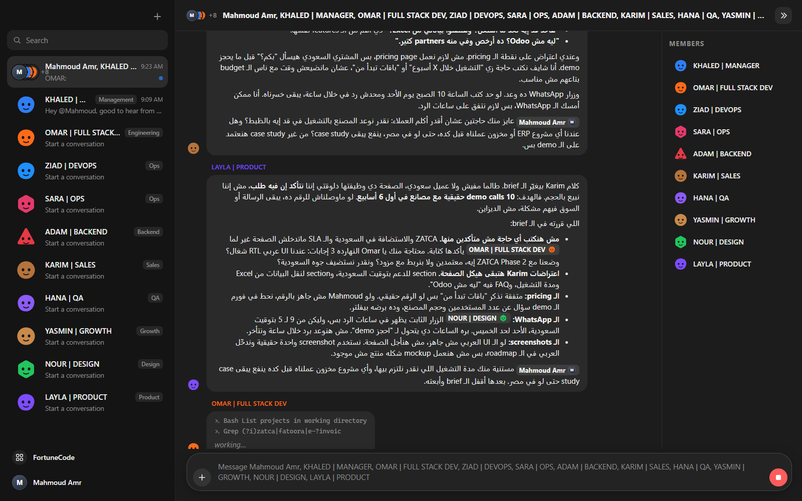
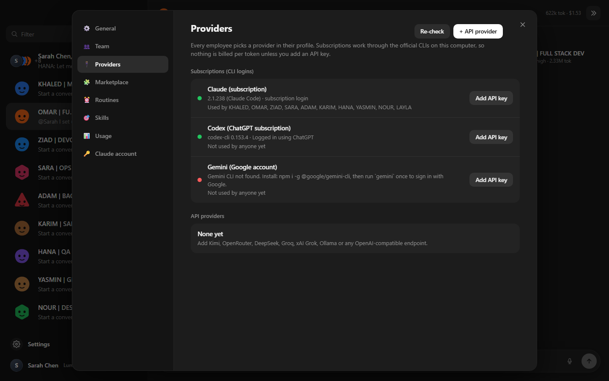
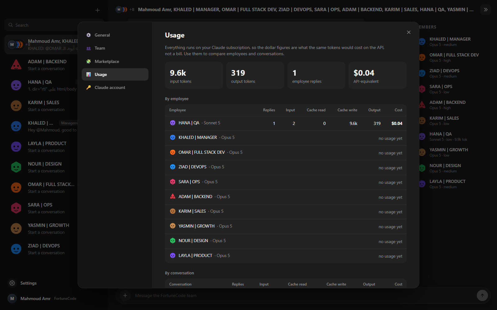
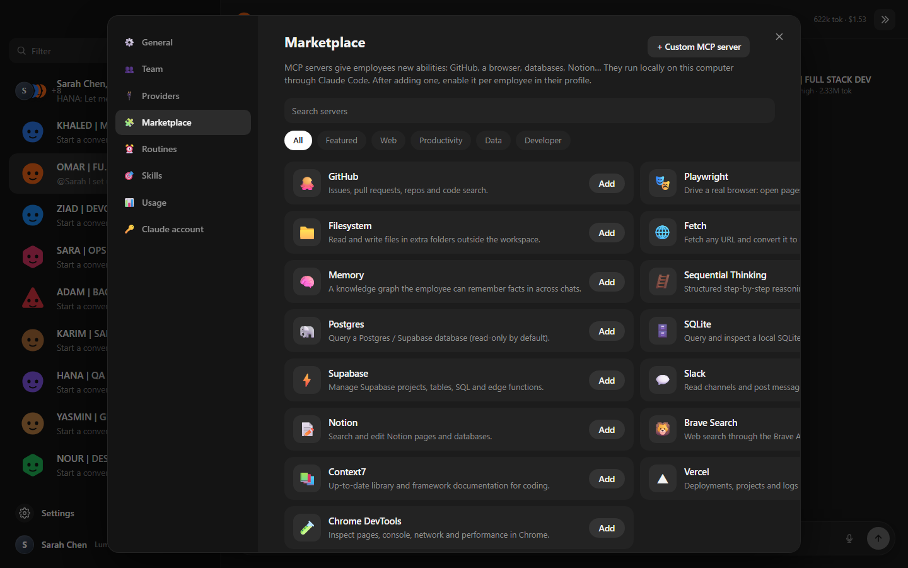

# OpenGrokBot — the open-source Grok Bot alternative

**Looking for a Grok Bot alternative?** OpenGrokBot gives you the same thing people loved in xAI/Cursor's Grok Bot, a *company of AI employees debating in a group chat*, but open source, running on your own machine, on the subscriptions you already pay for: **Claude** (Claude Code login), **ChatGPT** (Codex CLI login), **Google Gemini** (Gemini CLI login, the same account Antigravity uses), or **any OpenAI-compatible API** (Kimi, OpenRouter, DeepSeek, Groq, xAI Grok, Ollama…).

No Cursor Pro. No SuperGrok. No trial that ends. No "Upgrade to Pro" wall. MIT licensed.



```
You:    يا جماعة، عايز نعمل landing page جديدة لخدمة الـ ERP. @LAYLA و @NOUR ابدأوا
LAYLA:  تمام يا @Mahmoud، هبدأ بس محتاجة أعرف كام حاجة الأول…
NOUR:   متفقة مع @LAYLA في الأسئلة… بس عندي كام نقطة من ناحية الديزاين
KARIM:  بصراحة يا @LAYLA، إحنا لسه ماقفلناش deal ERP مع مصنع سعودي…
OMAR:   › Bash rg --files -g '*.ts'   › Read system/DEPLOY.md
        الـ outage بتاع النهارده…
```

## Grok Bot vs OpenGrokBot

| | Grok Bot (xAI / Cursor) | OpenGrokBot |
|---|---|---|
| Price | Cursor Pro or SuperGrok subscription; free trial ends | Free. Uses the Claude / ChatGPT / Gemini plan you already have, or any API key |
| Models | Grok only (Cursor's cloud picks) | Claude Opus/Sonnet/Haiku, GPT/Codex, Gemini, Kimi, DeepSeek, Grok via xAI API, local Ollama… per employee |
| Where it runs | Cursor's cloud "computer" | Your machine. Nothing leaves it except calls to the provider you chose |
| Employees talk to each other | ✅ | ✅ Mentions, rounds, muting, "mentions only" mode |
| Real tools | ✅ | ✅ Read/edit files, run commands, web search, subagents, MCP servers |
| Plugins / MCP | Marketplace | Marketplace of MCP servers (GitHub, Playwright, Postgres, Supabase, Slack, Notion, Context7, Vercel…) + custom |
| Usage & limits | Plan usage only | Tokens and cost per message, per employee, per conversation, per model; Claude limit windows |
| Edit employees | Name, label, description | Everything: provider, model, effort, personality, tools, permissions, working folder, MCP, mute, duplicate |
| Group chats | ✅ | ✅ Any subset of the team, pin, rename, export to Markdown |
| Arabic / RTL | Partial | Native RTL, replies in Egyptian Arabic when you write Arabic |
| Source | Closed | MIT, TypeScript, ~5k lines you can read in an afternoon |

## What you get

- **A team, not a chatbot.** Manager, full-stack dev, DevOps, ops, backend, sales, QA, growth, design and product ship in the box. Each has a personality, a color, an avatar shape and a department badge. Add, duplicate, mute or delete anyone in two clicks.
- **They talk to each other.** Mention someone (`@OMAR`) and only they answer. Post something general and everyone weighs in, in order, each seeing the earlier replies. When an employee mentions a colleague, the colleague answers. Rounds are capped so nobody loops forever, and an employee with nothing to add stays quiet.
- **They do real work.** Employees use Claude Code / Codex / Gemini tools in your workspace: read repos, grep, edit files, run commands, search the web. Tool activity streams live under the message. Permissions and working folder are per employee.
- **Bring your own subscription.** Claude Code, Codex CLI and Gemini CLI use their own logins. Every employee picks a provider and model, so your manager can be Opus, your dev can be Codex, and your intern can be a free local Ollama model.
- **MCP marketplace.** One click each, enabled per employee, or point an employee at your whole `~/.claude` setup.
- **Usage and limits.** Tokens and API-equivalent cost everywhere; your Claude subscription's limit windows with reset times.
- **The rest.** Group chats, DMs, pins, export, notifications, desktop window (Electron) or browser.

| Providers | Usage | Marketplace |
|---|---|---|
|  |  |  |

## Install

Requirements: Node 20+ and at least one of these signed in on your machine:

| Provider | How it signs in | Install |
|---|---|---|
| Claude (Anthropic) | `claude` CLI, your Claude Pro/Max login | `npm i -g @anthropic-ai/claude-code` then `claude` |
| Codex (OpenAI) | `codex login`, your ChatGPT/Codex subscription | `npm i -g @openai/codex` then `codex login` |
| Gemini (Google) | `gemini` once, your Google account (same as Antigravity) | `npm i -g @google/gemini-cli` then `gemini` |
| Any API | An API key you paste in Settings → Providers | Nothing to install |

```bash
git clone https://github.com/Z4YT0N/OpenGrokBot
cd OpenGrokBot
npm install
npm run build
npm run desktop        # desktop window (Electron)
# or:  npm start       # then open http://127.0.0.1:4310
```

First start copies `team.example.json` to `team.json`. Open Settings → General to set your name, company and workspace folder, then say hi to the team.

> Windows note: if `node_modules/electron/dist` has no `electron.exe` after install, unzip the cached `electron-v*-win32-x64.zip` from `%LOCALAPPDATA%\electron\Cache\<hash>\` into that folder and write `electron.exe` into `node_modules/electron/path.txt`. The `npm run desktop` launcher also strips `ELECTRON_RUN_AS_NODE`, which VS Code terminals export.

## How providers work

| | Claude | Codex | Gemini | API |
|---|---|---|---|---|
| Runs through | Claude Agent SDK (Claude Code) | `codex exec --json` | `gemini --output-format json` | `POST /chat/completions` |
| Billing | Subscription login, or API key if you add one | ChatGPT subscription, or `OPENAI_API_KEY` | Google account, or `GEMINI_API_KEY` | Your key |
| Memory | Resumable session per employee per chat | Resumable thread per employee per chat | Recent transcript each turn | Recent transcript each turn |
| Tools | Read/Edit/Bash/Glob/Grep/WebSearch/WebFetch/subagents + MCP | Codex's own tools; sandbox follows the employee's tools | Gemini's own tools; approval mode follows the employee's tools | Built-in local tools: read/list/search/edit/write files, run commands, fetch URLs |
| Effort | ✅ | ✅ (`model_reasoning_effort`) | ignored | ignored |

Prompts go to the CLIs over stdin, never as arguments, so Arabic and other non-ASCII text survive Windows shells. API keys live in `team.json` on your disk (git-ignored) and are never returned to the browser.

## FAQ

**Is there a free alternative to Grok Bot?**
Yes, this one. OpenGrokBot is MIT licensed and runs locally. The only cost is whatever AI plan you already have (Claude, ChatGPT, Gemini) or the API you point it at. A free local model through Ollama works too.

**Can I use Grok Bot with Claude, ChatGPT or Gemini?**
Grok Bot itself can't; its models are picked by Cursor's cloud. OpenGrokBot was built for exactly that: each employee runs on Claude Code, Codex CLI, Gemini CLI or an API of your choice.

**Does it work with my Claude subscription without an API key?**
Yes. It drives Claude Code through the official Agent SDK, which uses your existing `claude` login. Any `ANTHROPIC_API_KEY` in your environment is ignored unless you add a key on purpose.

**Can I still use Grok itself?**
Yes, add xAI as an API provider (`https://api.x.ai/v1`) and give an employee `grok-4` or `grok-code-fast-1`.

**Is this affiliated with xAI, Cursor or Oracle's OpenGrok?**
No. "Grok Bot" is xAI/Cursor's product; Oracle's OpenGrok is an unrelated code-search engine. OpenGrokBot is an independent open-source project.

**Does it speak Arabic?**
Yes. Replies mirror your language (Egyptian Arabic when you write Arabic, technical terms stay in English), the UI is RTL-aware, and you can force Arabic or English in Settings.

## بديل Grok Bot مفتوح المصدر

OpenGrokBot هو بديل مجاني ومفتوح المصدر لـ Grok Bot (بتاع xAI وCursor): شركة كاملة من الموظفين الذكاء الاصطناعي في جروب شات واحد، كل موظف له شخصية ودور وأدوات حقيقية، وبيتناقشوا مع بعض ومعاك. بيشتغل على اشتراك Claude أو ChatGPT (Codex) أو Gemini اللي عندك أصلًا، أو أي API زي Kimi أو OpenRouter أو Ollama محلي. بيرد بالعربي المصري لما تكتب عربي، والواجهة بتدعم RTL. مفيش Cursor Pro ولا SuperGrok ولا trial بينتهي.

## Settings

- **General:** company, your name, workspace, group reply mode (everyone / mentions only), reply language (auto / Egyptian Arabic / English), notifications, round caps.
- **Team:** every employee; click to edit name, role, label, color, shape, provider, model, effort, personality, tools, permissions, working folder, MCP servers, auto-approve, mute.
- **Providers:** status of each CLI login, API keys, and any number of OpenAI-compatible providers with presets (Kimi, xAI, OpenRouter, DeepSeek, Groq, OpenAI, Mistral, Ollama).
- **Marketplace:** one-click MCP servers or a custom stdio/HTTP/SSE server.
- **Usage:** totals, by employee, by conversation, by model.
- **Claude account:** login type, Claude Code version, limit windows, refresh.

Right-click any chat for Pin, Rename/Edit chat, Edit profile, Mute, Duplicate, Export as Markdown, Clear, Delete.

## `team.json`

Everything the UI edits lives here. Safe to edit by hand; restart afterwards.

| field | meaning |
|---|---|
| `agents[].provider` | Key into `providers` (`claude`, `codex`, `gemini`, or one you added). |
| `agents[].model`, `effort` | Model id for that provider (`default` = the CLI's own default) and `low` … `max`. |
| `agents[].tools`, `permissionMode`, `cwd`, `autoApproveTools` | What the employee may do and where. |
| `agents[].mcpServers`, `inheritClaudeSettings` | Claude only: team MCP servers to enable, and whether to load your `~/.claude` setup. |
| `agents[].muted` | Only speaks in groups when mentioned. |
| `providers` | `{ kind, label, apiKey?, baseUrl?, models? }`. Built-ins `claude`, `codex`, `gemini` always exist. |
| `settings` | `groupMode`, `language`, `notifications`, `maxMessagesPerRound`, `maxTurnsPerAgentPerRound`, `maxTurnsPerReply`. |

Conversations are JSON files under `data/conversations/`.

## Layout

```
server/            Express + SSE, orchestrator, usage + account tracking, team/provider editing API
server/providers/  claude.ts (Agent SDK), codex.ts, gemini.ts, openai.ts (+ local tools), cli.ts
client/            Vite + React UI (chat, profile panel, settings, marketplace, providers)
shared/            Types and catalogs shared by both
desktop/           Electron shell + launcher
docs/              Landing page (GitHub Pages) and screenshots
team.example.json  The starter company
```

`npm run dev` for hot reload (server :4310, client :5180). `npm test` for the unit tests.

## Contributing

Issues and PRs welcome. Good first contributions: more marketplace MCP entries, more API presets, a light theme, WhatsApp/Telegram bridges, packaged installers.

## License

MIT. Built by [Mahmoud Amr](https://github.com/Z4YT0N) at FortuneCode, with Claude.
